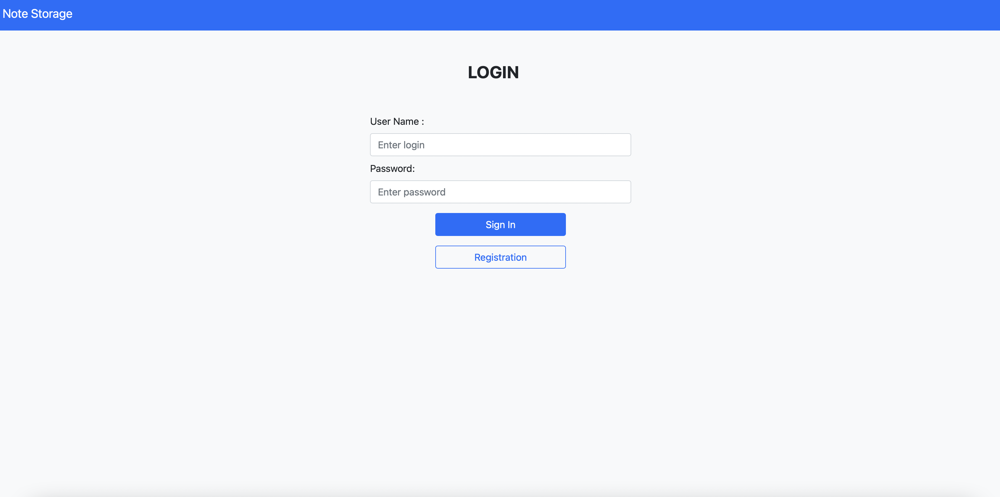

# NotesStorage 
[NotesStorage](https://goit-notes.herokuapp.com)

Before the start of application you have to add environment variables:

  - DB_USERNAME - username of user to connect to the database
  - DB_PASSWORD - password of user
  - DB_URL - database URL

For example:

  - export DB_USERNAME=admin

  - export DB_PASSWORD=super_secret_password

  - export DB_URL=jdbc:postgresql://localhost:5432/postgres
